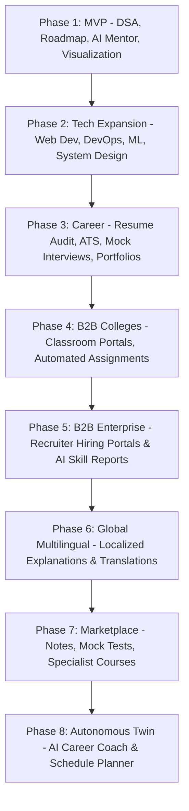

# CodeViz Academy: The Intelligent visual Coding & Career Sandbox Platform

CodeViz Academy is a unified, AI-powered visual coding ecosystem that transforms programming education from passive consumption into an interactive, personalized, gamified, and collaborative experience. Unlike existing platforms that focus solely on isolated code practice or static video courses, CodeViz combines execution visualization, adaptive Socratic mentoring, dynamic personalized roadmaps, project-based portfolios, built-in real-time collaboration, and recruiter verification logs in a single cohesive environment.

---

## 1. One-Line Pitch & Positioning

> **"Most platforms teach coding or test coding. CodeViz Academy understands how you learn coding, visualizes every concept, adapts to your weaknesses, and guides you from beginner to job-ready developer in one integrated platform."**

---

## 2. Existing Platforms vs. CodeViz Academy

| Platform | Core Focus | Critical Limitations | CodeViz Academy's Unified Solution |
| :--- | :--- | :--- | :--- |
| **LeetCode** | DSA Practice | Sirf DSA practice. Extremely overwhelming and intimidating for absolute beginners. No concept visualization. | **Beginner-Friendly Visualization**: Starts with interactive animations, visual pointers, and Socratic guidance before jumping to raw sandbox code compilation. |
| **HackerRank** | Assessment & Practice | Weak progress tracking, rigid roadmaps, and no visual debugger. | **Learning DNA & Real-Time Roadmaps**: Generates custom schedules based on your exact conceptual weaknesses and coding velocity. |
| **freeCodeCamp**| Structured Courses | Low personalization. Rigid curricula. Lacks dynamic mentorship or active debugging guides. | **Socratic AI Mentor & Predictor**: Detects *why* you failed a test case, guides you with hints, and warns you when you're about to forget a concept. |
| **Coursera / Udemy** | Video Lectures | Passive "tutorial hell". No real-time coding rooms, collaborative debuggers, or community coding loops. | **Project-Based Learning & Auto-Deploy**: Automatically builds real-world applications (e.g. Netflix clones) directly linked to your portfolio and GitHub. |
| **YouTube** | Free Content | Zero structure, no execution feedback, no practice sandbox, and zero progress tracking. | **One-Click Learning Engine**: Enter a concept (e.g. Heap) and get theory, visual animation, code templates, quizzes, and tasks in one unified view. |
| **GitHub** | Code Hosting | Hosting only. Does not guide your learning journey or provide coding analysis. | **Portfolio Builder & Recruiter Portal**: Extracts your coding habits, consistency, and "Learning Replays" into a verified profile for recruiters. |
| **Discord / WhatsApp** | Community | Group chats are scattered. Finding quality answers is tedious; no code execution context. | **Community Coding Rooms**: WhatsApp-style chat integrated with sandbox editors. AI summarizes long chats and pins verified answers automatically. |

---

## 3. The 20 Core Pillars of Novelty

### 🧠 1. AI Visual Learning & Execution Trace Visualizer
CodeViz does not just print static terminal outputs. When a user runs code (e.g., reversing a singly linked list), the platform auto-generates a dynamic, stateful animation:
* Shows Node nodes, links, and active pointer allocations.
* Visualizes pointers moving in real-time (`curr`, `prev`, `next`).
* Step-by-step code debugger trace linking the highlighted line of code with visual state transitions.

### 🤖 2. Socratic AI Mentor
Instead of behaving like a basic question-answer chatbot that spoils the solution, CodeViz acts as a real-world Socratic guide:
* If a student says *"I don't understand recursion"*, the AI does not write code. It pivots: *First*, it explains the memory call stack; *second*, it simulates a dry run; *third*, it shows a visual animation; *fourth*, it asks the user to fill in the base case.
* Self-adjusts to the user's competency level (novice, intermediate, or advanced) and supports localized language explanations (Hindi, English, etc.).

### 🗺️ 3. Personalized Roadmaps & "Learning DNA"
Static roadmaps treat all students as identical. CodeViz creates a living, dynamic representation of your skills:
* **The Learning DNA Profile** automatically logs whether your errors are syntax-based, logical, conceptual, or time-management related.
* Maps a custom network of nodes (e.g., Array, Graph, DP) colored in Green, Yellow, or Red to show your strength. If you are weak in Tree Traversals, the AI reshapes your next milestone to strengthen that node before introducing Graphs.

### ⏳ 4. Forgetting Prediction Engine
Based on Ebbinghaus' forgetting curve, the platform tracks when you last practiced a topic and predicts when your knowledge will fade:
* *"You learned Binary Search 14 days ago. Your probability of retention is down to 22%. Revise now!"*
* Automatically queues personalized revision sheets and micro-challenges to solidify long-term memory.

### 🐛 5. AI Bug Detective & Explain My Code
* **AI Bug Detective**: If a process errors (such as a `Segmentation Fault`), it displays where the null pointer was dereferenced, showing the specific memory cell and stack trace visually.
* **Explain My Code**: Highlights block-level code blocks, translating raw code loops into easy-to-read, step-by-step logic summaries with variables tracing.

### 💻 6. Visual Debugger
Allows students to step forwards and backwards through their code.
* Shows active arrays, index markers (`i`, `j`), and variables inside the stack memory.
* Animates swaps, inserts, and pointer re-assignments, making abstract memory operations concrete.

### 🎮 7. Gamified Adventure Mode & Coding Games
Learning programming is gamified as a role-playing adventure game:
* **Code Escape Room**: Puzzles where variables, loop conditions, and array lookups act as keys to escape to the next difficulty room.
* **Multiplayer Code Battles**: Real-time coding matches for 2–10 players on a live leaderboard.
* **Bug Hunt**: Players compete to locate, explain, and fix pre-injected bugs within a countdown.
* **Algorithm Race**: Watch sorting algorithms (Bubble Sort vs. Quick Sort vs. Merge Sort) execute side-by-side to visually compare time complexity.

### 🤝 8. Community Coding Rooms & Buddy Finder
* Combines WhatsApp-style messaging threads with an active coding editor.
* **Buddy Finder**: An AI matching mechanism that connects learners based on location, timezone, tech stack (e.g. React), coding velocity, and shared goals.
* AI compiles community chat transcripts, generates instant digests, and pins the best explanations.

### 🎥 9. Built-in Meetings & Collaboration Room
* Built-in audio/video calling, real-time shared cursors (Google Docs for Code), collaborative canvas whiteboards, and screensharing.
* Eliminates the need to switch between Zoom, Discord, and VS Code for pair programming or mock interviews.

### 🏗️ 10. Project-Based Learning & Portfolio Auto-Builder
* No certification is issued for passive video watching. Students must build, configure, and compile complete projects (e.g., a Netflix Clone or an Expense Tracker).
* On project completion, CodeViz automatically updates the student's connected GitHub, updates their live resume, and hosts their project on a custom portfolio page.

### 🚀 11. AI Project Reviewer & Architecture Visualizer
* **AI Project Reviewer**: Inspects full project repositories. Reviews directory structure, naming standards, UI/UX accessibility, security vulnerabilities, and database query efficiency.
* **Architecture Visualizer**: Scans project files and auto-generates interactive microservice diagrams (e.g., React Client ➔ Express Server ➔ Redis Cache ➔ MongoDB Database) to help students learn system design.

### 💼 12. AI Career Navigator & ATS Audit
* Guides learning towards specific job goals (e.g., "Full-Stack Engineer at Stripe"). Recommends required libraries, missing portfolio segments, and estimates time-to-hire.
* Evaluates resumes against ATS parsers, providing localized grammar, skill alignment, and LaTeX formatting improvements.

### 🗣️ 13. AI Interview Simulator
* Simulated conversational interviews (text or voice-to-text) matching specific job roles.
* Provides structured feedback on communication confidence, conceptual accuracy, and edge-case coverage.

### 🏫 14. College Dashboard & Virtual Classrooms
* Equips professors with diagnostic toolkits: track student progress, catch academic dishonesty through syntax style verification, assess overall classroom weak points, and automate assignment grading.

### 🏢 15. Recruiter Mode & AI Learning Replay (The Digital Twin)
* Allows employers to look past static resumes. Recruiters can view a developer's real-time **AI Learning Replay**.
* Replays the candidate's actual problem-solving progression: *Tried brute force ➔ hit Time Limit Exceeded (TLE) ➔ optimized space complexity ➔ resolved memory leak ➔ accepted solution*. This verifies genuine problem-solving capabilities.

---

## 4. Custom Chatbot Model Training & Fine-Tuning Pipeline

To power the Socratic AI Mentor without incurring high token costs or latency from third-party APIs, CodeViz Academy uses a custom fine-tuning process.

### Training Architecture:
1. **Base Model**: Fine-tuned on top of open-source weights (such as `Llama-3-8B-Instruct` or `DeepSeek-Coder-7B`).
2. **Dataset Curation**:
   * **Socratic Dialogue Dataset**: 80,000+ conversation logs where the mentor answers coding queries with progressive hints, avoiding direct code answers.
   * **Code-to-Visual-State Dataset**: Mapping of code expressions to visual state graphs (JSON representations of heaps, arrays, lists, and trees).
   * **Common Bug DB**: 120,000+ compiler execution failures paired with step-by-step explanations of pointers, scopes, and memory allocations.
3. **Training Methodology**:
   * **QLoRA (Quantized Low-Rank Adaptation)**: Fine-tuning weights in 4-bit precision, reducing memory footprint for local training runs.
   * **Alignment (RLHF/DPO)**: Direct Preference Optimization (DPO) to penalize giving away direct solutions, rewarding Socratic prompt guidance.
4. **Global Inference Pipeline**:
   * Deployed via a optimized `vLLM` inference cluster.
   * Leverages streaming tokens with local caching of common queries (e.g., standard explanation templates for pointers) to achieve sub-100ms response times.

---

## 5. Startup Scaling Roadmap

### Phase Details:
* **Phase 1 (0 to 10k Users)**: Individual SDE Students. Focused on core DSA visualizer, Socratic Mentor chatbot, personalized roadmaps, and community rooms.
* **Phase 2 (10k to 100k Users)**: Advanced Dev Curriculum. Adding Web Development, DevOps, Mobile, and System Design tracks.
* **Phase 3 (100k to 500k Users)**: Placement Readiness. Releasing automated ATS checks, portfolios, and mock interview rooms.
* **Phase 4 (B2B Colleges)**: Institutional Subscriptions. Deploying portal management for universities, monitoring student metrics, and automated grading systems.
* **Phase 5 (Hiring Portals)**: Recruiting. Charging corporations to host custom challenges, access candidates, and view verified AI learning replays.
* **Phase 6 (Global Multi-Language)**: Dynamic language conversion (Hindi, Spanish, German, etc.) for explanations, lowering the barrier to entry globally.
* **Phase 7 (Expert Marketplace)**: Allowing seasoned developers to sell mock exams, custom projects, or system design templates, with CodeViz taking a transaction cut.
* **Phase 8 (Enterprise & Certifications)**: Standardized company training programs, proctored licensing examinations, and verified skill badges.

---

## 6. Technical Scaling Architecture

To support scaling from hundreds to millions of users, CodeViz Academy uses a multi-tier, decoupled, event-driven infrastructure:

* **Frontend Framework**: Next.js (React) using Tailwind CSS for UI layouts and Zustand for lightweight local state caching.
* **Backend Core**: Clustered Node.js (Express.js) master/worker threads distributing computations across CPU configurations.
* **State & Sync Gateway**: Socket.IO cluster integrated with Redis Pub/Sub adapters to synchronize chat and collaborative editors across servers.
* **Database Strategy**:
  * **MongoDB**: Distributed database using replica sets for high availability, with indexed lookup paths (e.g. `{ userId: 1, sheetType: 1, problemId: 1 }`).
  * **Redis**: Used for session tokens, caching database calls, and job queues.
* **AI Compute Sandbox**: Decoupled Python-based LLM microservices to evaluate, format, and explain compilation traces without executing untrusted user code directly on worker servers.
* **DevOps Pipeline**: Containerized Docker deployments managed under Kubernetes (EKS/GKE), using Cloudflare CDN to cache static payloads globally.
