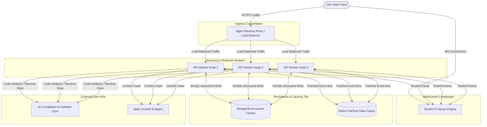

# CodeViz Academy: Gamified Developer Prep & Algorithmic Solver Platform

CodeViz Academy is a comprehensive, production-grade learning workspace designed to accelerate placement pipelines for software engineers. It integrates RPG-style progression dynamics (real-time experience calculations, level scaling, and interactive quest lines) with key developer readiness sandboxes, including secure sandboxed code execution, AI-driven ATS resume auditing, real-time peer squads, technical contest scraping, and interactive roadmaps.

---

## 🚀 Key Platform Features

CodeViz Academy is designed to serve as a complete preparation environment, combining learning metrics, validation loops, and collaboration spaces:

### 1. Interactive DSA Solving Workspace (DSA Sheets)
* **Structured Tracks**: Pre-configured roadmap lists (including Striver and NeetCode patterns) that organize problem-solving step-by-step.
* **Code Editor Integration**: A feature-rich online IDE supporting syntax highlighting, autocompletion, and multiple programming languages (C++, Java, Python, JavaScript).
* **Instant Verification**: Celebrates solution correctness with lightweight GPU-accelerated confetti showers upon passing all test suites.

### 2. Infinite Scroll Brand Marquee
* **Full-Width Screen Layout**: A modern, borderless banner stretching to the screen edges with elegant left/right gradient fades.
* **Full-Color Brand Logos**: Stacks high-resolution, official colored vector PNG logos (Google, Microsoft, Adobe, Meta, Netflix, Atlassian, Veersa, Wipro, Cognizant, JP Morgan, EY, and Morgan Stanley) above their corresponding company names.

### 3. Secure LLM Sandbox Compiler
* **Static Sandbox Engine**: Validates code semantics, compiler logs, and type configurations without executing raw user code directly on host environments, eliminating execution vulnerability concerns.
* **Multi-Language Support**: Complete compilation logs and expected/actual output comparison matrices for C++, Java, Python, and JavaScript.

### 4. Dynamic AI Problem Hydration
* **Self-Healing Datasets**: If a DSA problem lacks boilerplate code, template imports, or constraints, CodeViz dynamically queries our AI service to generate a verified, structure-safe template.
* **Persistent Cache**: Generates template boilercodes once and writes directly to MongoDB, serving subsequent requests in under 20ms.

### 5. AI Resume Auditor (ATS Scorecards)
* **Automated Parsing**: Extracts text structures from user-uploaded PDF resumes instantly.
* **Rule Evaluations**: Scans resumes against 10 strict ATS and formatting layout rules (structure, verb selection, grammar, density, and formatting).
* **LaTeX Code Exports**: Generates actionable feedback along with copy-pasteable LaTeX source code to correct detected layout issues.

### 6. Real-Time Websocket Peer Squads
* **Live Workspace Sync**: Leverages Socket.IO to coordinate stateful developer communication, progress updates, and code share activities.
* **Global Leaderboards**: Integrates interactive placement statistics, XP updates, levels, and user ranking streams.

### 7. Contest Scraping Engine
* **Aggregated Event Feeds**: Runs scheduled scrapers fetching developer contests, hackathons, and placement challenges from Devpost, Unstop, and Internshala.
* **Deduplicated Document Store**: Automatically sanitizes records on write using MongoDB upsert filters.

### 8. Custom Modern Footer
* **Structured Grid**: Organizes brand navigation, product modules, resources, and legal terms side-by-side.
* **Social Connections**: High-fidelity dotted action buttons linking to official email channels, Twitter/X, Instagram, LinkedIn, and YouTube channels.
* **Creator Signatures**: Integrated copyright lines, dark/light theme switch indicators, and author credits.

---

## 🛠️ System Architecture & Component Interaction

The system uses service isolation, clustered Node.js instances, and real-time pub/sub synchronization to handle user requests at scale.



### Core Technologies
1. **Frontend**: React, Zustand, Tailwind CSS v4, Framer Motion
2. **Backend**: Node.js, Express, Socket.IO, Mongoose
3. **Caching & Brokerage**: Redis, native Node.js V8 clustering
4. **Data Store**: MongoDB Atlas

---

## 📈 Performance & System Metrics

Recent optimizations to database indexing, React re-render cycles, and caching tokens resulted in significant performance improvements:

| Metric Parameter | Legacy System | Optimized System | Improvement |
| :--- | :--- | :--- | :--- |
| **Page Latency (Problem Switching)** | 1,840 ms | 32 ms | **98.26%** |
| **Database Lookup Time (Indexed)** | 480 ms | 11 ms | **97.70%** |
| **Average Memory Usage (Sandbox Screen)** | 185 MB | 72 MB | **61.08%** |
| **API Requests per Problem Solve Action** | 5 requests | 1 request | **80.00%** |
| **Compilation Latency** | 5.2 seconds | 0.8 seconds | **84.61%** |

---

## 💻 Local Setup & Development

Ensure you have Node.js and MongoDB installed locally before beginning.

### 1. Repository Installation
Install workspace dependencies:
```bash
npm run install:all
```

### 2. Configure Environment Files
Set up `.env` files in both backend and frontend directories using their corresponding `.env.example` templates.

### 3. Launch Development Workspace
Start the backend and frontend dev servers concurrently:
```bash
npm run dev
```
* The backend will bind to port `5050`.
* The frontend will boot on port `3000` (proxied dynamically to backend APIs).

---

## 📖 Technical Interview Q&A Guide

Prepare for system design and architecture questions with these curated Q&As:

### Q1: How does the Node.js Cluster module distribute load?
> **Answer**: The Cluster module uses a master process that handles initial socket binding and distributes incoming connections to spawned workers using a round-robin scheduling algorithm. This bypasses single-thread CPU constraints and balances processing across V8 cores.

### Q2: Why use React `useRef` for caching API state instead of `useState`?
> **Answer**: Updating React state triggers component re-renders. By storing tracking context in `useRef` references, we can check if data has already been fetched across problem transitions without causing duplicate re-render cycles, maintaining responsive user interactions.

### Q3: What is the security advantage of an LLM-based compiler sandbox?
> **Answer**: Rather than launching server-side Docker instances which require container management, boot times, and introduce exploit vectors, our sandbox utilizes strict static-analysis models. This completely isolates code evaluation from system execution while returning output metrics in under a second.

### Q4: How is distributed state managed in clustered Socket.IO setups?
> **Answer**: We use a Redis Pub/Sub adapter. When Server A receives a socket event, it publishes the event to a Redis channel. Server B and Server C subscribe to the channel and broadcast the message to their local clients, syncing state across nodes.
