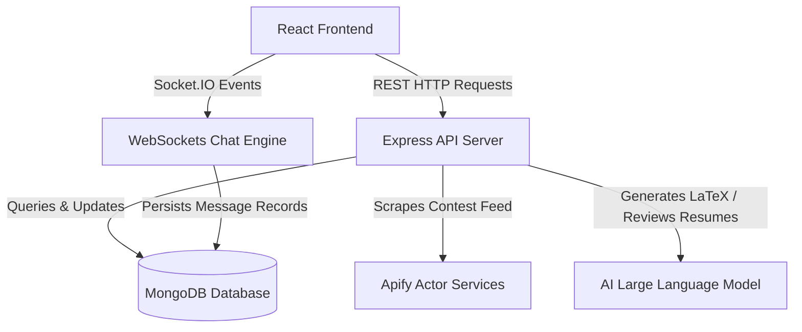

# StudyQuest OS: Gamified Career and Interview Preparation Platform

StudyQuest OS is a gamified, free-of-cost career development and interview preparation portal. It merges gaming mechanics (RPG skill trees, daily quests, experience multipliers) with interview preparation tools, including AI resume auditing, adaptive mock interview sandboxes, crowdsourced free study materials, Coding Platform trackers, and WebSockets-enabled community forums.

---

## Architecture Flow Diagram



---

## Detailed Feature Map

| Feature | Basic (Level 1) | Advanced (Level 2) |
| :--- | :--- | :--- |
| **Company-Wise Prep Hub** | Top 50 coding questions and core topics list for target companies (Google, Meta, Amazon, Netflix, Uber). | Simulated timed company sandbox assessments with behavioral checklist reviews. |
| **Job-Wise Prep Paths** | Visual roadmap nodes for core disciplines (Frontend, Backend, DevOps, AI, Fullstack). | Interactive checkpoints requiring quiz verification and capstone project validations. |
| **AI Resume LaTeX Auditor** | Parsed content review evaluating sections, formats, and impact verbs for an initial ATS rating. | Job Description Matcher and LaTeX Builder generating code for the Harshibar Overleaf Template. |
| **AI Mock Interview Simulator** | Linear chat-based recruiter asking standard role-relevant questions. | Voice/text recruiter that escalates question difficulty dynamically and scores results. |
| **Communities & Chatrooms** | Topic-specific WebSocket text channels (General, Frontend-Prep, Leetcode-Daily). | Peer lobbies, custom community squads, group quest sync, and real-time code snippet sharing. |
| **Hackathon Bulletins** | Event notifications parsed from Devpost, Unstop, and HackerEarth via Apify. | Team finder dashboard matching squad requirements based on profile ratings. |
| **Coding Profile Trackers** | Stats widgets loading solve counts and contest ratings for LeetCode, CodeChef, and Codeforces. | Streak tracking and coding aggregate boards syncing profile completions to game experience points. |
| **Interactive DSA Sheets** | Checklist versions of Striver A-Z, Love Babbar 450, and NeetCode 150. | Automated check-offs matching solved problem IDs directly with coding profile trackers. |
| **Gamified Dashboard Core** | Daily checklists, simple Pomodoro timers, and basic progress bars. | RPG Skill Trees, Github-style activity heatmaps, ambient sounds, and weekly predictive analytics. |

---

## Directory Structure

```
CodWiz/
├── backend/
│   ├── src/
│   │   ├── config/            # Database configurations and environment rules
│   │   ├── controllers/       # Route action handlers (auth, resume, chat, quest, etc.)
│   │   ├── middleware/        # JWT verifications, error handling, rate limiting
│   │   ├── models/            # Mongoose schemas (User, Message, Community, Quest, etc.)
│   │   ├── routes/            # Route declarations for API endpoints
│   │   ├── utils/             # Helper libraries and WebSocket socket.js servers
│   │   ├── app.js             # Express app setup and middleware initialization
│   │   └── server.js          # Main listener start entrypoint
│   ├── .env.example           # Backend environment configuration baseline
│   ├── package.json           # Node dependencies
│   ├── tsconfig.json          # TypeScript configurator (reference placeholder)
│   └── README.md              # Backend documentation
└── frontend/
    ├── public/                # Static assets and graphics
    └── src/
        ├── assets/            # Vector illustrations and custom style configurations
        ├── components/
        │   ├── features/      # Modular feature views
        │   │   ├── analytics/ # Completion estimators and stats boards
        │   │   ├── challenges/# Quiz engines with adaptive metrics
        │   │   ├── communities-chat/ # Real-time Socket.IO chat windows
        │   │   ├── company-prep/ # Company-wise interview paths
        │   │   ├── dsa-sheets/ # Striver, Babbar, and NeetCode checklists
        │   │   ├── evolution-tree/ # Skill tree interactive node charts
        │   │   ├── focus-mode/ # Focus timers and music selectors
        │   │   ├── friends/   # Buddy comparative leaderboards
        │   │   ├── hackathons/# Live feed cards fetched from Apify
        │   │   ├── heatmap/   # Grid streak trackers
        │   │   ├── mock-interview/ # AI mock recruiter client UI
        │   │   ├── platform-tracker/ # User stats from Leetcode, Codechef, etc.
        │   │   ├── quests/    # Quest checkboxes and XP multipliers
        │   │   ├── reports/   # Weekly radar performance charts
        │   │   ├── resume-auditor/ # Upload panel and LaTeX editor view
        │   │   ├── resource-library/ # Crowdsourced material lists
        │   │   ├── roadmap/   # Career roadmap viewports
        │   │   ├── role-prep/ # Job-wise checkpoint cards
        │   │   └── skill-dna/ # Custom radar chart visualizations
        │   ├── layout/        # AppLayout containers, Sidebar, Header
        │   └── ui/            # Basic buttons, models, fields, tooltips
        ├── hooks/             # React Hooks (useAuth, useTimer, useSocket)
        ├── lib/               # Server communication clients (Axios configs)
        ├── styles/            # Tailwind CSS style utilities
        ├── App.jsx            # Main route dispatcher
        ├── main.jsx           # Mounting entrypoint
        └── index.css          # Global CSS containing Tailwind imports
    ├── index.html             # Vite build HTML skeleton
    ├── package.json           # React dependencies
    ├── vite.config.js         # Vite configuration with Tailwind v4
    └── README.md              # Frontend documentation
```

---

## Technology Stack

### Frontend
- React JS
- Vite
- Tailwind CSS v4 (using @import and vite plugins)
- Framer Motion (micro-interactions and animations)
- Recharts (radar charts and analytics)
- Socket.IO-Client (real-time chat updates)
- Zustand (lightweight client state management)

### Backend
- Node.js
- Express
- MongoDB with Mongoose ORM
- Socket.IO (WebSockets room coordinator)
- PDF-Parse (resume parser)
- Axios (integration queries)

---

## Local Setup

### Prerequisite
Ensure Node.js (v18+) and MongoDB are installed on your machine.

### Frontend Installation
1. Open a terminal and navigate to the frontend directory:
   ```bash
   cd frontend
   ```
2. Install the package dependencies:
   ```bash
   npm install
   ```
3. Run the development server:
   ```bash
   npm run dev
   ```

### Backend Installation
1. Open a terminal and navigate to the backend directory:
   ```bash
   cd backend
   ```
2. Create your env parameters from the example file:
   ```bash
   cp .env.example .env
   ```
3. Install the dependencies:
   ```bash
   npm install
   ```
4. Start the Express server:
   ```bash
   npm run start
   ```
