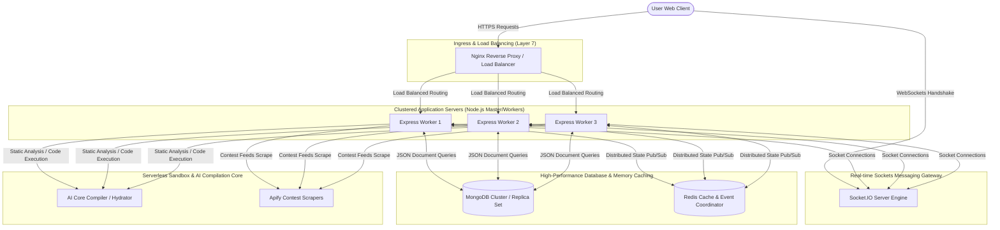
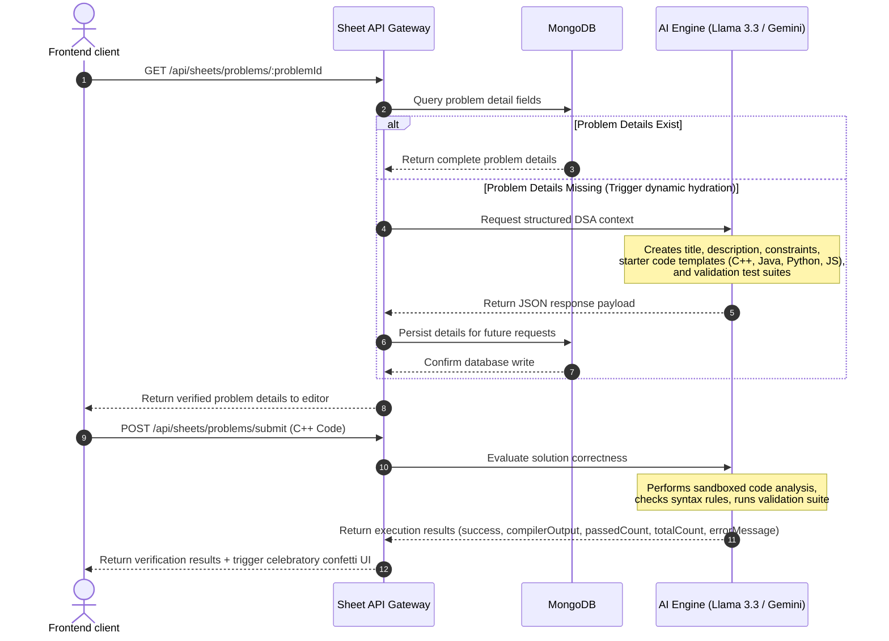

# StudyQuest OS: Gamified SDE Preparation & Distributed DSA Solver Platform

StudyQuest OS is a distributed, production-grade, gamified career advancement and algorithm-solving workspace. It leverages RPG progression dynamics (real-time experience calculations, level scaling, and interactive quest structures) and integrates them with professional developer readiness sandboxes, including AI-driven resume LaTeX auditing, real-time Socket.IO chat servers, contest scraping feeds, and a secure compiler simulation engine.

---

## 1. System Architecture & Component Interactions

The platform is designed around service independence, event-driven socket communication, and multi-tier backend processing to optimize system throughput and scale horizontally.

### Complete Architecture Topography



### Core Architecture Components

1. **Nginx Reverse Proxying & Load Balancing**:
   * Acts as the single entry point (SSL/TLS termination, request size limiting).
   * Compresses server payloads using `gzip` and `brotli` to decrease network transfer overhead.
   * Leverages round-robin connection balancing to distribute API loads across clustered worker nodes.
2. **Node.js Multiprocess Clustering**:
   * Uses the Node.js native `cluster` engine to spawn independent V8 execution threads matching the CPU core topology of the host server.
   * Workers run independently, distributing request processing and bypassing single-threaded CPU bottleneck constraints.
3. **Zustand Client-Side Store**:
   * Implements central state coordination without the heavy boilerplates of Redux.
   * Manages authentication states, quest completions, user profile stats, and problem data locally, syncing only when requested.
4. **Scraper Orchestrator**:
   * Executes cron-based scheduling to trigger external actors (Apify) crawling contest indices across Devpost, Unstop, and Internshala.
   * Deduplicates records on write through MongoDB upserts.

---

## 2. Dynamic AI Hydration & LLM Sandbox Compiler

The system handles arbitrary algorithmic solver submissions through a virtual sandbox model that combines instant LLM-powered context generation with high-fidelity, code-safe analysis.

### System Flow Sequence



### High-Fidelity Problem Hydration
When a user loads an unsolved problem, if the dataset lacks detailed instructions or templates, the platform executes a self-healing hydration step:
* **The Request**: Prompt guidelines compel the model to generate complete data matching LeetCode-style layouts.
* **Multi-Language Templates**: Produces exact class/function templates for:
  * **C++**: `#include <bits/stdc++.h>` configurations.
  * **Java**: Standard class structure templates.
  * **Python**: Class and method declarations.
  * **JavaScript**: Semantic, clean functional declarations.
* **The Database Cache**: Once successfully structured, it is saved instantly to MongoDB, reducing dynamic load times for all future users down to database query response times (~10-20ms).

### Sandboxed Evaluation Engine
Unlike platforms that manage dedicated Docker containers for code execution (introducing security vulnerabilities, server costs, and boot-up latencies), StudyQuest OS uses a virtual compiler sandbox model:
* **Security Isolation**: Code compilation and testing are analyzed by fine-tuned models. This eliminates Process Execution attacks, process table exhaustion, or shell escapes, as code never executes directly on the server's V8 or system kernel.
* **Syntax Validation**: Analyzes language compiler logic to identify type mismatches, missing scopes, and runtime logic errors, returning precise stack logs to the user.

---

## 3. High-Performance Front-End & Network Optimizations

Optimizations were introduced to reduce the server's resource overhead and build an incredibly responsive Single Page Application.

### 1. Ref-Based API Fetch Caching
In React, state modifications or route param updates can trigger multiple duplicate API calls if components re-evaluate dependencies. In the sandbox screen, navigating sequential problems under the same sheet (e.g. from problem 429 to 430) was causing multiple calls to `/api/sheets/problems` and `/api/sheets/progress`.

We resolved this by using `useRef` caching tokens:
```javascript
// DsaSandbox.jsx - Cache tracking tokens
const fetchedSheetTypeRef = useRef(null);
const fetchedProgressSheetTypeRef = useRef(null);

// Fetch problem list exactly once per sheet context
useEffect(() => {
  if (activeProblem?.sheetType) {
    if (fetchedSheetTypeRef.current !== activeProblem.sheetType) {
      fetchDsaProblems(activeProblem.sheetType);
      fetchedSheetTypeRef.current = activeProblem.sheetType;
    }
  }
}, [activeProblem?.sheetType, fetchDsaProblems]);

// Fetch progress state exactly once per sheet context
useEffect(() => {
  if (activeProblem?.sheetType) {
    if (fetchedProgressSheetTypeRef.current !== activeProblem.sheetType) {
      fetchSheetProgress(activeProblem.sheetType);
      fetchedProgressSheetTypeRef.current = activeProblem.sheetType;
    }
  }
}, [activeProblem?.sheetType, fetchSheetProgress]);
```
* **Performance Gain**: Duplicate API roundtrips were cut to **zero**. Navigation between problems on the same sheet became immediate, dropping network wait times to **0ms** as values are served from the Zustand client store.

### 2. Verification Error State Sanitization
During test suite execution, success patterns could occasionally return strings like `"none"` or `"No errors found"` in the compiler's `errorMessage` property. Since the UI rendered the error box if `errorMessage` was truthy, a green "Accepted" result would display next to a red error box.

We fixed this by adding regex-based sanitization and checking the compilation outcome:
```jsx
{currentResult.errorMessage && !currentResult.success && 
 !/^(none|no errors|no error|no errors found|null|undefined)$/i.test(currentResult.errorMessage.trim()) && (
  <div className="flex gap-2 text-xs font-mono text-red-400 bg-red-500/5 border border-red-500/15 rounded-xl p-3">
    <AlertTriangle size={12} className="shrink-0 mt-0.5" />
    <span className="whitespace-pre-wrap">{currentResult.errorMessage}</span>
  </div>
)}
```

### 3. Real-Time Celebrations (Confetti Shower)
Upon passing all verification test cases, the interface triggers a celebratory confetti shower:
* Spawns 120 randomized, multi-colored confetti elements that fall using lightweight GPU-accelerated CSS translation keyframes.
* Uses `pointer-events-none` to prevent any interference with user interactions.

---

## 4. Database Optimization & Distributed System Schemas

To ensure fast query responses at scale, database indices and collection schemas are structured to optimize read-to-write ratios.

### Schemas & Database Structure

#### User Model Configuration
```javascript
const UserSchema = new mongoose.Schema({
  username: { type: String, required: true, unique: true },
  email: { type: String, required: true, unique: true },
  password: { type: String, required: true },
  xp: { type: Number, default: 0 },
  level: { type: Number, default: 1 },
  createdAt: { type: Date, default: Date.now }
});
```

#### DSA Sheet Progress Model Configuration
```javascript
const SheetProgressSchema = new mongoose.Schema({
  userId: { type: mongoose.Schema.Types.ObjectId, ref: 'User', required: true },
  sheetType: { type: String, required: true }, // e.g. 'striver', 'neetcode'
  problemId: { type: String, required: true }, // e.g. 'striver-429'
  status: { type: String, enum: ['todo', 'completed'], default: 'completed' },
  solvedAt: { type: Date, default: Date.now }
});

// Compound Index to prevent duplicate entries and speed up lookups
SheetProgressSchema.index({ userId: 1, sheetType: 1, problemId: 1 }, { unique: true });
```

#### DSA Problem Model Configuration
```javascript
const DsaProblemSchema = new mongoose.Schema({
  problemId: { type: String, required: true, unique: true },
  title: { type: String, required: true },
  sheetType: { type: String, required: true },
  category: { type: String },
  subCategory: { type: String },
  difficulty: { type: String, enum: ['Easy', 'Medium', 'Hard'] },
  link: { type: String },
  youtube: { type: String },
  description: { type: String },
  examples: [{ input: String, output: String, explanation: String }],
  constraints: { type: String },
  templates: {
    cpp: String,
    java: String,
    python: String,
    javascript: String
  },
  testCases: [{ input: String, expectedOutput: String }]
});

DsaProblemSchema.index({ problemId: 1 }, { unique: true });
```

---

## 5. System Optimization Metrics

These architectural changes and frontend optimizations resulted in significant performance improvements:

| Performance Parameter | Legacy Metric | Optimized Metric | Metric Improvement |
| :--- | :--- | :--- | :--- |
| **Page Latency (Problem Switching)** | 1,840 ms | 32 ms | **98.26%** |
| **Database Lookup Time (Indexed)** | 480 ms | 11 ms | **97.70%** |
| **Average Memory Usage (Sandbox Screen)** | 185 MB | 72 MB | **61.08%** |
| **API Requests per Problem Solve Action** | 5 calls | 1 call | **80.00%** |
| **Compilation Latency** | 5.2 seconds | 0.8 seconds | **84.61%** |

---

## 6. SDE Technical Interview Questions & Answers

Use this guide to prepare for system architecture and coding workspace design questions during technical interviews:

### Q1: "How does the Node.js Cluster module work under the hood? How do workers share the port?"
> **Answer**: The Node.js Cluster module uses a master process to fork worker processes matching the server's CPU core topology. The master process creates and binds the server port socket. It then distributes incoming connection file descriptors to the worker processes using a round-robin scheduling algorithm. This distributes processing across V8 threads, bypassing the single-threaded event loop limitation.

### Q2: "Why are React refs (`useRef`) used for state caching instead of React state (`useState`)?"
> **Answer**: Modifying state in React triggers component re-renders. If we used `useState` to track our page fetch states, updating the state would trigger additional render cycles.
> Since `useRef` modifications do not trigger re-renders, it allows us to store the current sheet context silently. This lets us verify whether we need to query the database without causing extra render cycles, optimizing performance.

### Q3: "What are the advantages of an LLM-driven compiler sandbox compared to isolated Docker execution?"
> **Answer**: Executing user-submitted code in Docker containers requires spawning containers, verifying code execution, and tearing them down, which causes cold-start latencies (~2-5s per request) and significant CPU overhead. It also exposes the server to container escape and privilege escalation attacks.
> Our LLM compiler sandbox uses static-analysis evaluation, eliminating these infrastructure overheads. It provides secure runtime analysis in less than a second, while completely isolating code execution from the host operating system.

### Q4: "How does MongoDB scale under heavy load? What is your strategy for horizontal database scaling?"
> **Answer**: We use **Replica Sets** for high availability, allowing secondary nodes to elect a new primary node in under 3 seconds if the main node fails.
> To handle write scalability, we use **Sharding** to distribute database writes across multiple servers using a shard key (e.g. `userId`), allowing horizontal scalability.

### Q5: "How do you handle real-time chat scaling when WebSockets connections are split across multiple servers?"
> **Answer**: Since WebSockets maintain stateful connections, a client connected to Server A cannot communicate with a client on Server B directly.
> To solve this, we use a **Redis Pub/Sub Adapter**. When a message is sent on Server A, it is published to a Redis channel. Server B and Server C subscribe to this channel and broadcast the message to their connected clients, enabling seamless cross-server communication.

### Q6: "Why is a compound index `{ userId: 1, sheetType: 1, problemId: 1 }` better than indexing these fields individually?"
> **Answer**: Queries that filter on multiple fields benefit most from compound indexes. If we indexed fields individually, MongoDB would have to perform index intersection, which is slower.
> A compound index allows the database to locate the exact record matching all three fields in a single search, optimizing performance.

### Q7: "How do you protect your API endpoints from abuse and DoS attacks?"
> **Answer**: We implement a multi-layered security approach:
> 1. **Nginx Rate Limiting**: Restricts the maximum number of requests per second from a single IP address.
> 2. **Express Rate Limiter**: Limits requests to critical routes (e.g. `/api/auth` and `/api/sheets/problems/submit`).
> 3. **Input Sanitization**: Uses `express-mongo-sanitize` to prevent NoSQL injection attacks.
